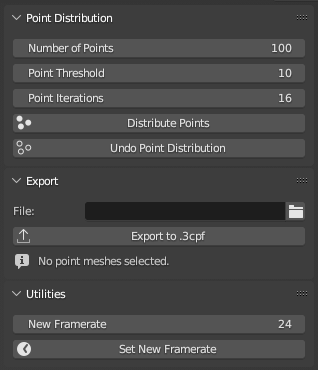
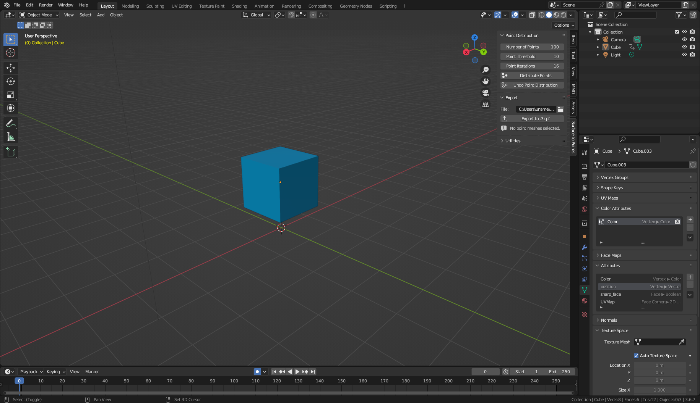
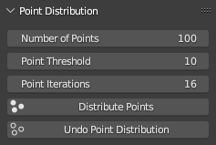
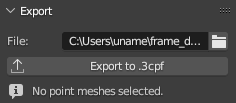
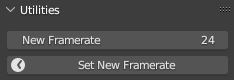
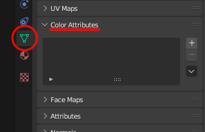
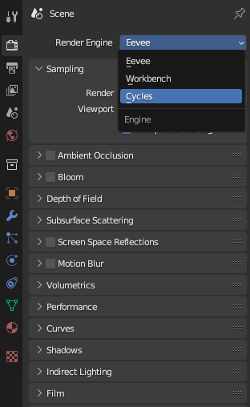
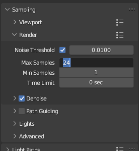
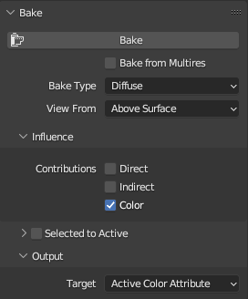

# Blender Animated Surface to Points

> A basic blender addon to export animated meshes to [3cpf](https://github.com/ruelalarcon/3cpf) files.

  

## Environment

**Compatible Versions**
+ Blender 3.6.0 or later (Tested on Blender 3.6.7)

## Features

+ Evenly distribute points across the surface of multiple meshes
+ Specify the target number of points to distribute
+ Use color data from a mesh's color attribute
+ Export those animated colored points across multiple frames to a 3cpf file
+ Utility to change the framerate of your animation through timewarping to easily export to any framerate

## Contents
+ [File Format](#file-format)
+ [Installation](#installation)
+ [Usage](#usage)
+ [Point Distribution Settings](#point-distribution)
+ [Export Settings](#exporting)
+ [Utilities](#utilities)
+ [Baking Point Colors](#point-colors)

## File Format

See [here](https://github.com/ruelalarcon/3cpf) for a specification on the 3cpf file format (which this addon exports to), or if you're working in Python, check out the [cpf3d](https://github.com/ruelalarcon/cpf3d) package.

## Installation

+ Download the latest release version from the [releases page](https://github.com/ruelalarcon/animated_surface_to_points/releases).
+ Open Blender.
+ Navigate to `Edit` -> `Preferences` -> `Add-ons` -> `Install`
+ Browse, select, and install the `.py` python addon file.
+ Enable the addon by selecting the checkbox next to its name.

## Usage

  

+ Open a blender scene.
+ Open the View3D window (shown above), hit the `N` key, and navigate to `Surface to Points` on the sidebar.
+ Select the meshes you wish to export. These meshes must have color attributes named 'Color'. More information about that [here](#point-colors).
+ Set up the [point distribution settings](#point-distribution) for your meshes.
+ Click on `Distribute Points` and wait for the message in the top left to say 'Point distribution complete.'
+ Select a file path in the Export panel
+ Click `Export to 3cpf` and wait for the addon to finish processing all of the frames of your animation. (This will export the frames between your selected start frame and end frame.)

## Point Distribution

  

| Item | Description |
|---|---|
| Number of Points | The approximate number of points you wish to distribute evenly across the surface of your mesh. When multiple meshes are selected, the distribution settings of the largest mesh will be followed. If you wish to have precise control over how many points each mesh has, it is recommended to distribute points one mesh at a time. |
| Point Threshold | How closely you wish to approximate the amount of points when distributing them. A threshold of 10 means that you accept a value within 10 points. A threshold of 0 means you want the exact number of points specified. |
| Point Iterations | How many maximum 'iterations' the approximation algorithm should make. Higher means more accuracy. |
| Distribute Points | Distributes points on the currently selected meshes with the settings chosen above. This will turn your mesh into two meshes, one holding only the distributed points `<meshname>_points`, and the other holding the original mesh `<meshname>_colors` (used for color and positional data). The points mesh contains geometry nodes that you are free to edit manually for finer control of point distribution. |
| Undo Point Distribution | Reverts the distribution of points on a mesh. When doing this, only select the meshes ending with `_points`, there is no need to select the meshes ending in `_colors`. |

## Exporting

  

| Item | Description |
|---|---|
| File | The file path you wish to export the `.3cpf` animation file to.  |
| Export | Exports the selected meshes as a `3cpf` animation between the animation's global Start Frame and End Frame. When clicking export, you only need to select the point meshes (`_points`), not the color meshes (`_colors`). |
| Note | A note that tells you the total amount of points within the point meshes you have selected. (Or when you do not have any point meshes selected) |

## Utilities

  

| Item | Description |
|---|---|
| New Framerate | A framerate value if you wish to change the framerate of the current animation for export. |
| Set New Framerate | Sets the framerate of the animation via Time Stretching. This is useful if you want to export a 3cpf animation that will be played a different framerate. This automatically sets a new Start Frame and End Frame for you based on the time stretching. |

## Point Colors

> The colors of the points are chosen via the color attribute of that mesh's respective color mesh.

For example, let's say I want to use the colors of a mesh's *texture.* here's how you can do so by *baking* its texture into a color attribute:

### Exporting a Mesh with its Texture's Colors

First, before distributing any points, select your mesh. Then naviage to Object Data Properties, and find Color Attributes.

Then, create a new Color Attribute by hitting the `+` button, and selecting OK. The domain should be `Vertex` and Data Type `Color`.

Next, go to Render Properties, and set `Cycles` as your Rendering Engine.

Now, still in your Render Properties, open `Sampling` -> `Render`, and change your Max and Min Samples to a lower number. (A higher number will take much longer, but have less detail. But for points, usually high detail is not necessary.)

Then, still in Render Properties, scroll to the **Bake** section, and apply the settings below, and click `Bake`.

Now the color attribute of your mesh contains the color data from its textures, and exporting points on this mesh will result in each point having the same color as the texture color at that point's position.

## Contributing

Any contributions are welcome. This project currently exists within a single python script due to the simplicity of its current features. If you plan on adding a significant amount of content, forking this project is also an option.

In any case, feel free to send me an email.